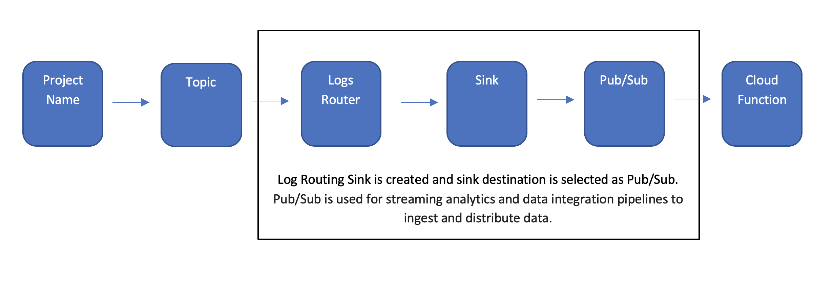
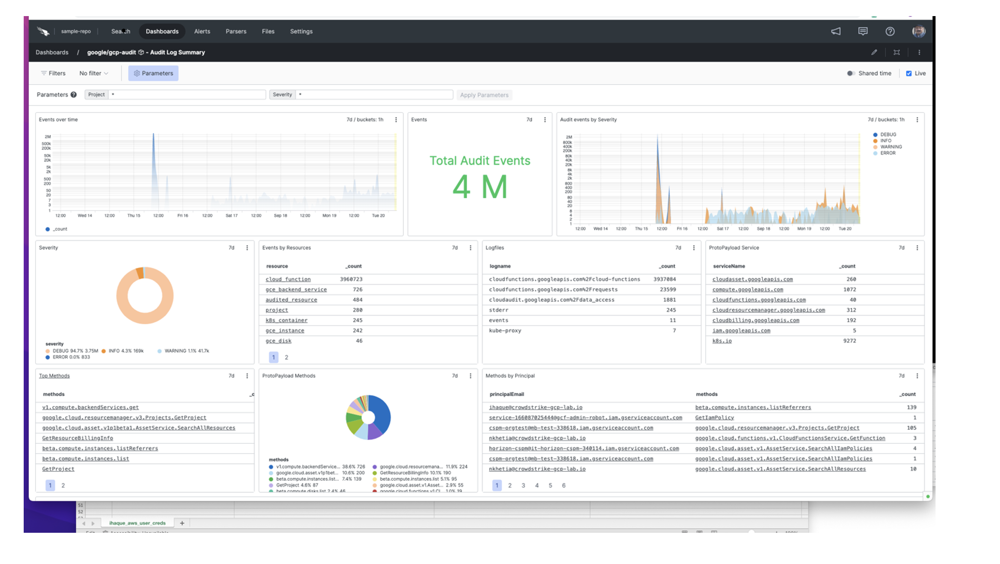
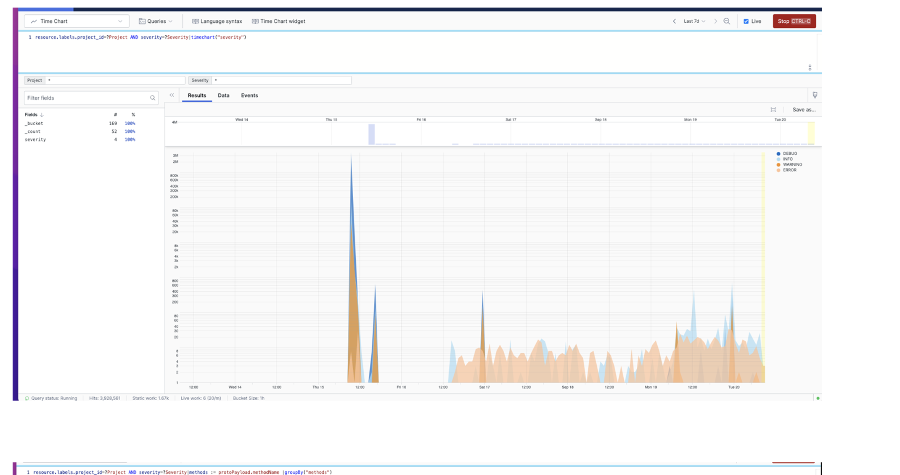
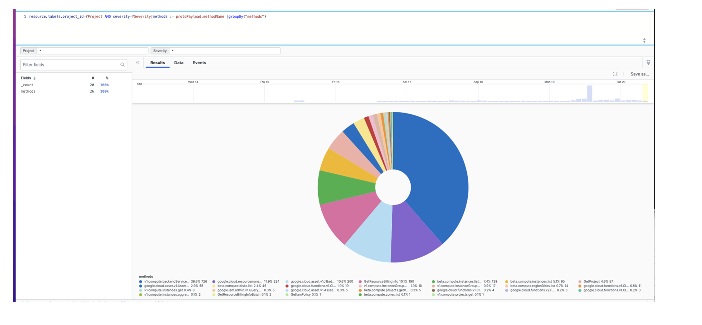
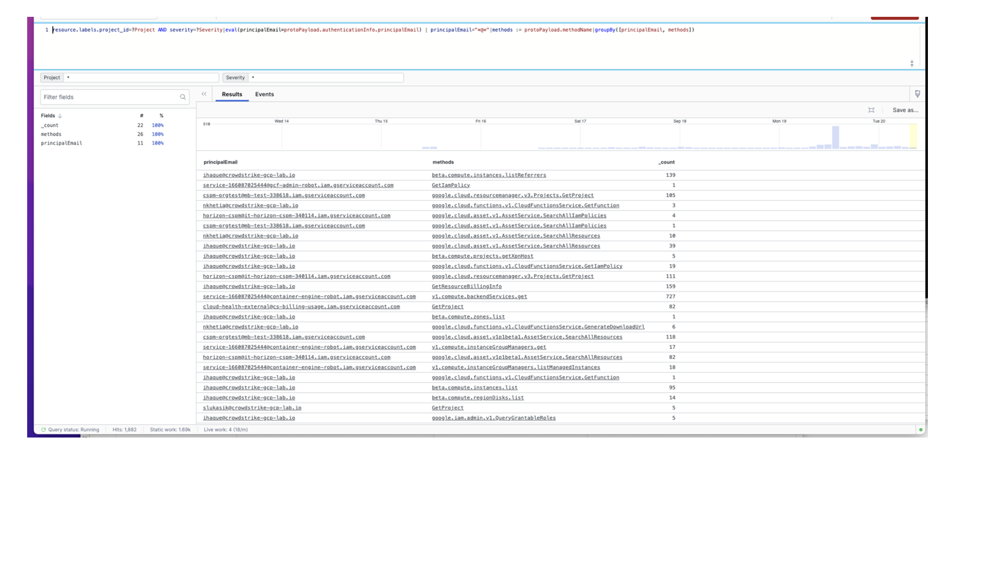

# Deploying and implanting Cloud function in GCP to transfer logs to Logscale for analysis
    Cloud Functions is an event-driven serverless computer platform. They can subscribe to events across a suite of cloud service and trigger based on those changes.

## Steps to configure

    •	Login to google cloud console.
    •	Create a project give a name and search for the topic and create the  “Topic”.
    •   select Cloud Functions -> serverless.
    •	search  and select ""topic" ->  in the dialog " enter the topic name".
    •	Once the topic has been created search for “Logs Router”, this will let you to create Sinks.  Sinks controls how Cloud Logging routes logs. Using “Sink” you can route some or all logs to the supported destinations.
    •	Select pub/sub is used to integrate  asynchronous service-to-services.
    •	The selected Code level is Python 3.8.
    •	Update the code based on the requirement and then select “Deploy”. This will save the configuration.

##  Flow Chart

            

## Setup function to transfer events  log to Logscale:

     •	First, we will need to get token by generating from a logscale repository. Click on “repository” then select “settings”.
       Next, you will select “ingest tokens” and then select “add token” and provide a token name.  You will then assign parser and save it. This will also generate a token.  Copy that token onto main.py python file in Cloud function. 

## Example below shows how to setup token in main.py file.
   
    

http = urllib3.PoolManager()
dest_url = "https://cloud.community.humio.com/api/v1/ingest/hec/raw"
dest_token1 = <xxxxxxxxxxxxxxxxxxxxxxxxxxxxxxxx>
header1 = {'Content-Type': 'application/json', 'Authorization': 'Bearer ' + dest_token1}

        http.request('POST', dest_url,body=newevent,headers=header1)

## Sample DashBoard

# 
