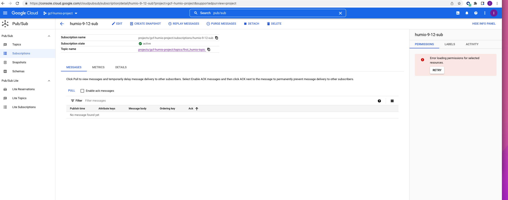
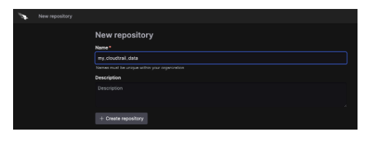

 

# GCP Function triggered through pyhon using Pub/Sub to send events to Falcon/LogScale.

## Configure and setup gcp function

- Login to google cloud console.
- Create a project give a name and search for the topic and create the  “Topic”.
- Select Cloud Functions -> serverless.
- Search  and select ""topic" ->  in the dialog " enter the topic name".
- Once the topic has been created search for “Logs Router”, this will let you to create Sinks.  Sinks controls how Cloud Logging routes logs. Using “Sink” you can route some or all logs to the supported destinations.
- Select pub/sub  ( is used to integrate  asynchronous service-to-services.
- The selected Code level is Python 3.8.
- Update the code based on the requirement and then select “Deploy”. This will save the configuration.

##  Configuring Pub/Sub in Google Cloud

## Diagram 
 

## Prepare LogScale
- Setup the Ingest Repository
- select, or create a target ingest repository

# Installing LogScale(Humio) Log Collector on Linux 

[LogCollector](https://library.humio.com/humio-server/log-shippers-log-collector-install-linux.html)

- create an ingest token, or use the default token

## configure ingest parsing

parseJson(handleNull=empty) | parseTimestamp(field=timestamp)

## Support

This package is supported by our product support team. If you have any issues implementing or running this package, please go to support@crowdstrike.com for assistance.

Setuop parser in logscale repository and generate token that will be used to configure (pub/sub) GCP function.

## Example configuring python script ( main.py)  to transfer audit-log  to LogScale Repository

Example below shows how to setup token in main.py file.

http = urllib3.PoolManager()
dest_url = "https://cloud.community.humio.com/api/v1/ingest/hec/raw"
dest_token1 = <xxxxxxxxxxxxxxxxxxxxxxxxxxxxxxxx>
header1 = {'Content-Type': 'application/json', 'Authorization': 'Bearer ' + dest_token1}

## Dependencies
- Log Output

This package requires minimum  parsing configuration in the parser.

parseJson(handleNull=empty) | parseTimestamp(field=timestamp)

## Time Zones
The parser will try to automatically detect timestamps in the logs, including time zone information. If no time zone is present though, the parser will assume the timestamp is UTC time. The best solution is to include timestamp information in the logs, but you can also modify the parser to provide a different default. Find the timezone argument in the findTimestamp function to change it.

